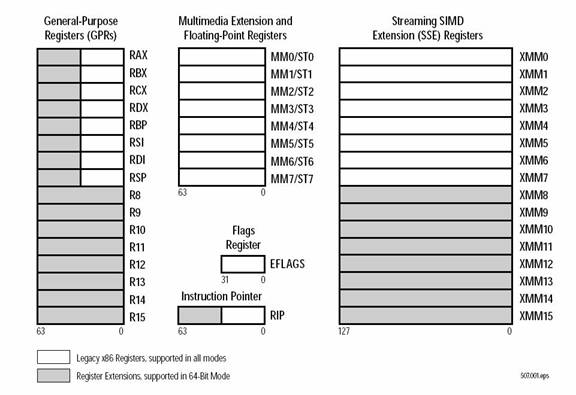

# 計算機系統
- [x86(32位元)計算機系統](#x86(32位元)計算機系統 )
- [x86-64計算機系統](#x86-64計算機系統 )

###  參考資料
- [Assembly Programming and Computer Architecture for Software Engineers(2017)](https://www.prospectpressvt.com/textbooks/hall-assembly-programming-and-computer-architecture-for-software-engineers) [[簡中譯本:匯編程序設計與電腦體系結構：軟件工程師教程]](https://www.tenlong.com.tw/products/9787111615163) [GITHUB(原始碼)](https://github.com/brianrhall/Assembly)
  - Chapter 2:Processor and System Architecture

## [Instruction set architecture(ISA)指令集架構](https://en.wikipedia.org/wiki/Instruction_set_architecture) [[中文說明]](https://zh.wikipedia.org/wiki/%E6%8C%87%E4%BB%A4%E9%9B%86%E6%9E%B6%E6%A7%8B)
- 指令集架構|指令集|指令集體系，是電腦架構中與程式設計有關的部分，包含了基本資料類型，指令集，暫存器，定址模式，儲存體系，中斷，異常處理以及外部I/O。
- 指令集架構包含一系列的opcode即操作碼（機器語言），以及由特定處理器執行的基本命令。
- 不同的處理器「家族」——例如Intel IA-32和x86-64、IBM/Freescale Power和ARM處理器家族——有不同的指令集架構。
- 指令集體系與微架構（一套用於執行指令集的微處理器設計方法）不同。使用不同微架構的電腦可以共享一種指令集。例如，Intel的Pentium和AMD的AMD Athlon，兩者幾乎採用相同版本的x86指令集體系，但是兩者在內部設計上有本質的區別。

- 指令集的分類
  - 複雜指令集電腦complex instruction set computer (CISC)包含許多應用程式中很少使用的特定指令，由此產生的缺陷是指令長度不固定。 x86架構微處理器與x86-64架構微處理器
  - 精簡指令集電腦reduced instruction set computer (RISC)通過只執行在程式中經常使用的指令來簡化處理器的結構，而特殊操作則以子程式的方式實現，它們的特殊使用通過處理器額外的執行時間來彌補。ARM架構
  - 理論上的重要類型還包括最小指令集電腦與單指令集電腦，但都未用作商業處理器。
  - 另外一種衍生類型是[超長指令字 very long instruction word (VLIW)] ，處理器接受許多經過編碼的指令並通過檢索提取出一個指令字並執行。

- 機器碼 Machine language is built up from discrete statements or instructions. 
- On the processing architecture, a given instruction may specify:
  - opcode (the instruction to be performed) e.g. add, copy, test
  - any explicit operands:
    - registers  ==> 用於算術運算，定址或者控制功能的特定暫存器
    - literal/constant values ==> 特定儲存空間的位址或偏移量；
    - addressing modes used to access memory ==> 用於解譯運算元的特定定址模式

## [Intel instruction set architecture (ISA)](https://www.intel.com/content/dam/www/public/us/en/documents/manuals/64-ia-32-architectures-software-developer-instruction-set-reference-manual-325383.pdf)
 
- http://www.intel.com/content/www/us/en/processors/architectures-software-developermanuals.html
- http://developer.amd.com/resources/documentation-articles/developer-guides-manuals/

## x86(32位元)計算機系統
- [x86](https://en.wikipedia.org/wiki/X86) [[中文說明]](https://zh.wikipedia.org/wiki/X86)
- [x86 Assembly Guide(下圖資料來源)](http://www.cs.virginia.edu/~evans/cs216/guides/x86.html)

資料來源:http://www.cs.virginia.edu/~evans/cs216/guides/x86.html

## x86-64計算機系統
- [x86-64](https://en.wikipedia.org/wiki/X86-64) [[中文說明]](https://zh.wikipedia.org/wiki/X86-64)
- The x86_64 instruction set is an extension of the x86 (32-bit) instruction set. 
- 32-bit operations are possible on x86_64 processors. 
- While the 64-bit nature of an x86_64 processor means that data and addresses can be stored with 64 bits, current x86_64 processors only utilize the lower 48 bits for addresses. 
-  The 48-bit physical address space allows the processor to address up to 256TB of RAM, a huge improvement over the 4GB maximum of a 32-bit processor.
-  In addition to being able to address more RAM, x86_64 processors also have eight more general purpose registers, r8 through r15.

- [X86 64 Register and Instruction Quick Start](https://cs.brown.edu/courses/cs033/docs/guides/x64_cheatsheet.pdf)
- [X86 64 Register and Instruction Quick Start](https://wiki.cdot.senecacollege.ca/wiki/X86_64_Register_and_Instruction_Quick_Start)
- [X86-64 Architecture Guide(MIT)](http://6.s081.scripts.mit.edu/sp18/x86-64-architecture-guide.html)
- [Guide to x86-64(stanford)](https://web.stanford.edu/class/archive/cs/cs107/cs107.1218/guide/x86-64.html)
- [x64 Architecture(微軟)](https://docs.microsoft.com/en-us/windows-hardware/drivers/debugger/x64-architecture)
- [Introduction to x64 Assembly(INTEL)](https://software.intel.com/content/www/cn/zh/develop/articles/introduction-to-x64-assembly.html)

- [說明範例x86 Assembly/X86 Architecture](https://en.wikibooks.org/wiki/X86_Assembly/X86_Architecture)

資料來源(Source): http://www.amd.com/us-en/assets/content_type/white_papers_and_tech_docs/x86-64_overview.pdf

- register 暫存器用途:
- rax/eax is commonly used as the default accumulator register. 
  - Operations such as multiplication will automatically place part of the result in rax/eax. 
  - Function calls use rax/eax for the return value. 
  - Do not use rax/eax for data storage when performing such operations.
- rcx/ecx is used to hold the loop counter value for executing loops. 
  - So, avoid using rcx/ecx to hold data inside of loops.
- rbp/ebp is used as the frame pointer for stack frames.
  - The register is used to reference data on the stack. 
  - We recommend only using rbp/ebp for its intended purpose.
- rsp/esp, the stack pointer register, is also used for stack management and typically points to the top of the active stack frame. 
  - Again, it is best to use rsp/esp for its intended purpose.
- rsi/esi and rdi/edi are index registers used with string operations such as STOSB, MOVSB, and SCASB to store, load, and scan large amounts of data. 
  - Such operations essentially put the CPU into an automatic loop mode that is more efficient than having the programmer write a loop.
- rip/eip is the extended instruction pointer register. 
  - The register is used to point to the memory address containing the next instruction to be fetched, decoded, and executed in a program and is adjusted automatically. 
  - Do not modify this register programmatically.
  - 駭客就是要控制rip/eip
- rflags/eflags is the status and control register. 
  - Special instructions such as LAHF and SAHF can be used to load and store the CPU flags from and to the ah register. 
  - Do not modify rflags/eflags directly. 
  - Bits in the rflags/eflags register are set automatically according to a set of Boolean rules after each arithmetic operation. 
  - Although rflags is 64-bits, only the lower 32-bits are utilized. 
  - Status flags are the same for both x86 and x86_64 processors.

- CPU flags are individual bits   Table 2.7 Viewable flags
  - control CPU operations in some way 
  - reflect the status of CPU operations
- Table 2.8 Editable flags in bit order for LAHF/SAHF

- Instruction Execution
  - instruction execution cycle
  - Pipelining | superpipeline

- Input and Output
- Programmed I/O and interrupt-driven I/O
- Direct memory access(DMA)
- cycle stealing

## 網路資源
- [Intel® 64 and IA-32 Architectures Software Developer Manuals](https://software.intel.com/content/www/us/en/develop/articles/intel-sdm.html)
- [COMPUTER SYSTEMS ORGANIZATION資源豐富的課程](https://cs.lmu.edu/~ray/classes/sp/)
   - [x86 Architecture Overview](https://cs.lmu.edu/~ray/notes/x86overview/)
   - [NASM Tutorial](https://cs.lmu.edu/~ray/notes/nasmtutorial/)
