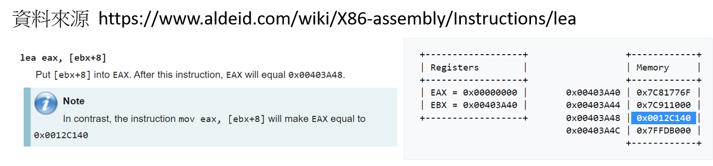

# 組合語言程式語法[以NASM(Intel)為主]

- [資料型態](#資料型態)
- [資料定義](#資料定義)
- [資料移動](#資料移動 )
- [算術運算: 加法|減法|乘法|除法|移位|處理負值](#算術運算)

- [資料定址](#資料定址)

- [分支(Branching)與跳轉指令](#分支(Branching)與跳轉指令)
- [Looping迴圈](Looping迴圈)


###  參考資料
- [Assembly Programming and Computer Architecture for Software Engineers(2017)](https://www.prospectpressvt.com/textbooks/hall-assembly-programming-and-computer-architecture-for-software-engineers) [[簡中譯本:匯編程序設計與電腦體系結構：軟件工程師教程]](https://www.tenlong.com.tw/products/9787111615163) [GITHUB(原始碼)](https://github.com/brianrhall/Assembly)
  - Chapter 3: Assembly and Syntax Fundamentals
  - Chapter 4: Basic Instructions
  - Chapter 5: Intermediate Instructions
  - Chapter 6: Functions 下一節說明
  - Chapter 7: String Instructions & Structures 請自我練習
- [哈佛大學 CS 61: Systems Programming and Machine Organization (2021)]()
- [哈佛大學課程中Assembly的介紹(gas)](https://cs61.seas.harvard.edu/site/2021/Asm/)
- [Chapter 3: The NASM Language](https://www.nasm.us/doc/nasmdoc3.html)

## 資料型態
- see textbook Chapter 1: Data Representation see Table 1.4 Integer storage sizes
- Number Systems:
- Integer Storage ==> byte | word | doubleword |quadword
- most significant bit (MSB) and least significant bit (LSB)
- Little-Endian vs Big-Endian byte order
  - Computers typically store data in memory in architecture-specific chunks (32 and 64 bits for x86 and x86_64, respectively), with values being composed of bytes. 
  - If we were to store the 32-bit hexadecimal value 12345678h into a computer’s memory, the 32-bit value is split into byte-sized chunks,
  - each hexadecimal digit is four bits, so two hexadecimal digits are one byte.


  - Intel’s x86 and x86_64 use Little-Endian ordering. 
  - Motorola’s 68XX[X] series processors, along with IBM’s Z series, use Big-Endian ordering. 
  - Some processors can use either, coined bi-endian, such as the Sun SPARC, ARM, and PowerPC

- Signed Integer Storage
  - Three of the basic arithmetic operations are forms of addition: (1) addition, (2) subtraction (adding a negative value), and (3) multiplication (repetitive addition). -  
  - Therefore, many CPU circuits are addition circuits
  - one’s complement, and two’s complement. 
  - In all three methods, the MSB indicates positive (0) or negative(1). 
  - Many modern architectures, such as x86 and x86_64, use two’s complement for signing integers

- Character Storage
  - character sets ==> [ASCII](https://en.wikipedia.org/wiki/ASCII) is the default character map for high-level languages such as C++. 

- [A 3-bit Computer Example](https://www.youtube.com/watch?v=gYczcmDywag)

- [練習buuble sort: assembly program vs C program](https://github.com/brianrhall/Assembly/tree/master/Chapter_1)


## 資料定義
- Data Definition:Data types in Assembly language are indicative of their size (8 bits, 16 bits, 32 bits, etc.) rather than their contents (integer, double, string, etc.) as in high-level programming languages
- NASM 
  - DB ==> 1 byte (8-bit) integer
  - DW ==> 2 byte (16-bit) integer
  - DD ==> 4 byte (32-bit) integer
  - DQ ==> 8 byte (64-bit) integer
  - DT ==> 10 byte (80-bit) integer
  - 範例 1: counter: DB 0    ;==>變數名稱counter| 1 byte (8-bit) integer | 初始值為0
  - 範例 2: wageArray: DD 75, 100, 125 ;==>array名稱wageArray | 4 byte (32-bit) integer | 初始值為75, 100, 125
- GAS and MASM 的定義 請參閱教科書 Table 3.11 Default data type directives

- 未初始化的變數(uninitialized variables) ==> 
  - NASM require that all uninitialized variables be created in the .bss (Block Started by Symbol) program segment. 
  - NASM require you to use data type directives specifically for uninitialized data
  - RES`B` 保留1 byte(8 位）
  - RES`W` 保留1 word(16 位）
  - RES`D` 保留1 doubleword(32 位）
  - RES`Q` 保留1 quad word(64 位）
  - RES`T` 保留l ten-byte(80 位）
  - 範例 1:
```
SECTION. bss
memAddr: RESD 1 ; Reserves 1 DWORD (4 bytes)
buffer: RESB 64 ; Reserves 64 bytes
```

- strings字串
  - strings are stored as BYTE arrays. 
  - Strings need to be null-terminated,hich m eans that the last byte must be ASCII-zero. 
  - Null-terminating a string is achieved differently depending on the assembler. 
  - NASM just use the literal value 0 as the last byte.
  - 斷行(\n)Line breaks  
    - Inserting line breaks is different depending on the assembler.
    - In NASM, only the LF (line-feed) hexadecimal code 0Ah needs to be inserted.
    - 範例:motd: DB "Hello", OAh, "NTHU CTFer", 0    ; The OAh in the middle of the string adds a newline

- Symbolic constants ==> 程式執行期間絕對不會變化的值
  - Symbolic constants hold 32-bit integers in x86 and 64-bit integers in x86_64 and are defined with the equal sign (=). 
  - Symbolic constants are for integer-based data
  - symbolic constants(hold expressions)
    - 所有的assembler都可以把運算式的值表示成Symbolic constants。
    - 必須用 EQU 命令來定義。
    - 各種assembler在定義符號常批時所採用的辦法有很大的不同。
    - 與定義變批時的要求不同，用EQU 所創建的符號既可以出現在資料段也可以出現在程式碼片段
    - NASM: 它可出現在SECTION.data 與SECTION.text 
    - assembler在對代碼做assemble的時候會把每一個出現這種符號的地方都替換成對應的運算式。
    - 範例: test: EQU (2 * 6 / 3) ; 
  - EQU 命令另一個用途:通過創建符號常量來表示某個識別字所指代的資料佔用了多大的記憶體空間。
    - 當前位置計數器(current location counter) 用來指代位置計數器的當前記憶體位址(NASM 用美元符號＄表示）
    - 將該位址與前一個字串的起始記憶體位址相減即可算出字串所佔據的位元組數
    - 範例:
```
motd: DB "I'm in the matrix?", 0
len: EQU ($ - motd)
```

## 資料移動 
- 資料移動 Data Movement   請參閱教科書 CHAPTER 4.Basic Instructions
- 語法格式代碼
  - L ==> A literal (immediate) value (e.g., 42)
  - M ==> A memory (variable) operand (e.g., numOfStudents).
  - R ==> A register (e.g., eax).

- NASM語法 [練習:GAS與MASM請參閱教科書]
  - NASM ; dest, src
  - NASM treats variables similar to the way pointers are treated in C++. 
  - sum 變數代表memory address  | [sum]代表該memory address的值 
  - Just using the identifier results in a memory address. 
  - If you want to refer to the data stored in the memory address, which is aliased by the identifier, you need to dereference the variable with brackets (e.g., [sum])

- MOV instruction
  - MOV copies data from the source location to the destination location
  - 兩個運算元的大小必須相同Both operands must be the same size
  - 兩個運算元不能全是記憶體運算元（也就是說要想在兩個記憶體運算元之間移動資料，必須用寄register做仲介）。
  - 指令指標寄存器(ip/eip/rip) 不能用作目標運算元。The instruction pointer register (ip/eip/rip) cannot be a destination operand

  - 語法格式: MOV SIZE [M]/R, L/[M]/R
  - 範例: MOV DWORD [sum], edx

- XCHG instruction 資料互換  swap
  - data in two locations needs to be swapped
  - 語法格式:XCHG SIZE [M]/R, [M] /R 
  - 範例: XCHG DWORD [sum], edx
  - XCHG instruction cannot be executed with two memory operands

## 算術運算
- 算術運算: 加法|減法|乘法|除法|移位|處理負值

- INC and DEC instructions
  - 語法格式:INC/DEC SIZE [M] /R 
  - 範例 1: INC DWORD [sum]
  - 範例 2: DEC eax
  
- ADD instructions
  - 語法格式: ADD SIZE [M]/R, L/[M]/R
  - 範例 : ADD WORD [sum], 50

- SUB instructions
  - 語法格式:SUB SIZE [M]/R, L/[M]/R
  - 範例 : SUB eax,[val]

- NEG instructions
  - gives you the ability to reverse the sign of a value, thus converting the value into its Two’s Complement representation
  - 語法格式:NEG SIZE [M] /R
  - 範例 :NEG BYTE [sum]

### [練習: 完成課本範例程式Program_4.1的測試](https://github.com/brianrhall/Assembly/tree/master/Chapter_4/Program%204.1)

### x86/Program_4.1_GAS_Linux.s [gas: src, dec] [自我練習: 完成64位元版本]
```c
.data
sum: .long 0
val: .long 25

.text
.globl _main
_main:

movl $0, %eax  ==> %eax =0
incl %eax      ==> %eax =1
addl $200, %eax ==> %eax =1 +200 = 201
subl val, %eax  ==> %eax = 201-25 =176
movl %eax, sum  ==> sum =176
decl sum        ==> sum =175 
negl sum        ==> sum =-175 

movl $1, %eax
movl $0, %ebx
int $0x80
.end
```

### x86/Program_4.1_NASM.asm[自我練習: 完成64位元版本]
```c
SECTION .data
sum: DD 0
val: DD 25

SECTION .text
global _main
_main:

mov eax, 0
inc eax
add eax, 200
sub eax, [val]
mov [sum], eax
dec DWORD [sum]
neg DWORD [sum]

mov eax, 1
mov ebx, 0
int 80h
```


- MUL instruction  請參閱教科書說明
  - performs unsigned integer [multiplication.](https://en.wikipedia.org/wiki/Multiplication) 
    - 4 multiplied by 3 | "3 times 4" |adding 3 copies of 4 together:
    - 3*4 = 4 + 4 + 4 = 12  
    - 3 (the multiplier) and 4 (the multiplicand) are the factors, and 12 is the product.
  - MUL accepts a single operand,the multiplier(乘數)
  - 範例 :mul bx
  - but what about the multiplicand(被乘數) and the result? 
  - The multiplicand(被乘數) is a value that is stored in the accumulator register based on the multiplier size (8, 16, 32, and 64-bit), see Table 4.2 Unsigned multiplication operands
```
mov ax, 64   ===> ax --- multiplicand(被乘數)  
mov bx, 8096  ===> bx --- multiplier(乘數)
mul bx ===>   
```
```
bx * ax = 518144 = 00000000000001111110100000000000
==>  dx = 0000000000000111, ax = 1110100000000000
```
  - Check the status of the CPU flags after a multiplication. 
  - After unsigned multiplication, the Carry Flag (CF) will be set if the product has carried into the high bits. 
  - After signed multiplication, CF will be set unless all the high bits are just the sign extension of the most significant bit of the low bits.

- IMUL instruction 有號數乘法(signed multiplication)  請參閱教科書說明
- DIV instruction 無號數除法(unsigned integer division) 請參閱教科書說明
- IDIV instruction.有號數除法(signed integer division) 請參閱教科書說明

### [完成課本範例程式Program_4.2的測試](https://github.com/brianrhall/Assembly/tree/master/Chapter_4/Program%204.2)

- Bit Shifting
  - SAL (Shift Arithmetic Left) and SAR (Shift Arithmetic Right)

- Working with Negative Values

### [完成課本範例程式Program_4.3 Negative division的測試](https://github.com/brianrhall/Assembly/tree/master/Chapter_4/Program%204.3)


## 資料尋址
- See textbook 4.3.2 資料定址 
- 直接定址(direct addressing) ==> 直接使用由該識別字所代表的內存位址上的資料
- 間接定址(indirect addressing) 
-  ==> 不直接使用某個記憶體位址上的資料，
-      而是把該資料也當成位址來確定另外一個記憶體位置，轉而使用那個位置上的資料

- NASM 的變數表示的就是其記憶體位址，而不是該位址中的值
- （如果想使用這個值，要用方括號括起來，例如[sum] ）
  - 範例:將變數的記憶體位址保存到另一個變數
  -  MOV DWORD [sumaddr], sum
  -  MOV SIZE [M]/R, M


### [完成課本範例程式Program_4.4Array的測試](https://github.com/brianrhall/Assembly/tree/master/Chapter_4/Program%204.4)


## 資料定址 

- Data Addressing

- LEA (Load Effective Address) instruction
  - The LEA instruction in 32-bit and 64-bit modes loads an operand address into the destination
  - LEA must be used for all runtime operations since actual addresses are not known until runtime.
  - 語法格式: lea destination, source
  - lea eax, [ebx+8] vs mov eax, [ebx+8] 的 [差別](https://www.aldeid.com/wiki/X86-assembly/Instructions/lea)



## Boolean Expressions
- AND OR NOT XOR
- see Table 1.7 Boolean symbols
- 應用 ==> see Example 1.19 Masking

## bitwise operator [See textbook 5.2 按位執行的布耳運算]
- bitwise operator : NOT  AND  OR  XOR
- 應用1:加密資料
- 應用2:更新數值(比方說，把寄存器清零）

- 把al register中的十進位值與1 做AND 運算。運算的結果仍然保存在al egister
- NASM ==> AND al, Oxl


## 分支(Branching)與跳轉指令
- 無條件跳轉 <=== 無條件跳轉指令JMP
- Conditional Jump 有條件跳轉 <===  
- 複合條件

### UnConditional Jump 無條件跳轉指令JMP

- 在3 種assemblers裡的用法是一樣的。GAS/MASM/NASM
- 語法格式:JMP LABEL 

```
top:
  mov al, 3
  add al, 5
  jmp bottom  <===無條件跳轉指令JMP

middle:
  add al, 32

bottom:
  add al, 2
```

## Conditional Jump 有條件跳轉! 重要

- Conditional test  ==> CMP vs TEST

### CMP instructions
- 語法格式: CMP destination, source
- CMP compares two numeric data fields. 
- The destination operand could be either in register or in memory. 
- The source operand could be a constant (immediate) data, register or memory.
- 範例 1:
```
CMP DX,	00  ; Compare the DX value with zero
JE  L7      ; If yes, then jump to label L7
.
.
L7: ...
```
- CMP is often used for comparing whether a counter value has reached the number of times a loop needs to be run. 
- 範例 1:
```
INC	EDX
CMP	EDX, 10	; Compares whether the counter has reached 10
JLE	LP1     ; If it is less than or equal to 10, then jump to LP1
```
### Conditional jump instructions
- [Conditional jump instructions can be divided into four groups:](https://www.philadelphia.edu.jo/academics/qhamarsheh/uploads/Lecture%2018%20Conditional%20Jumps%20Instructions.pdf)
  - 1.Jumps based on the value of a single arithmetic flag
  - 2.Jumps based on the value of CX or ECX
  - 3.Jumps based on comparisons of signed operands
  - 4.Jumps based on comparisons of unsigned operands
  
  - 語法格式:Jcond destination ; cond is the jump condition
  - 範例: JLE	LP1     ; If it is less than or equal to 10, then jump to LP1

- conditional jump instructions used on signed data used for arithmetic operations
  - JE/JZ ==>	Jump Equal or Jump Zero	==>	ZF
  - JNE/JNZ	==>	Jump not Equal or Jump Not Zero ==>		ZF
  - JG/JNLE	==>	Jump Greater or Jump Not Less/Equal	==>	OF, SF, ZF
  - JGE/JNL	==>	Jump Greater/Equal or Jump Not Less ==> OF, SF
  - JL/JNGE	==>	Jump Less or Jump Not Greater/Equal	==>	OF, SF
  - JLE/JNG	==>	Jump Less/Equal or Jump Not Greater	==>	OF, SF, ZF

- conditional jump instructions used on unsigned data used for logical operations
  - JE/JZ	==> Jump Equal or Jump Zero	==>	ZF
  - JNE/JNZ	==> Jump not Equal or Jump Not Zero==>		ZF
  - JA/JNBE	==>Jump Above or Jump Not Below/Equal	==>	CF, ZF
  - JAE/JNB	==> Jump Above/Equal or Jump Not Below	==>	CF
  - JB/JNAE	==>Jump Below or Jump Not Above/Equal ==>		CF
  - JBE/JNA	==>Jump Below/Equal or Jump Not Above ==>	AF, CF

- conditional jump instructions have special uses and check the value of flags 請參閱[資料](https://www.tutorialspoint.com/assembly_programming/assembly_conditions.htm)

- [範例分析:完成程式分析displays the largest of three variables.](https://www.tutorialspoint.com/assembly_programming/assembly_conditions.htm)
- [7.5 The Conditional Jump Instructions](https://flylib.com/books/en/1.332.1.130/1/)


### TEST instructions [[WIKI說明]](https://en.wikipedia.org/wiki/TEST_(x86_instruction)) 請參閱教科書說明
    - In the x86 assembly language, the TEST instruction performs a bitwise AND on two operands. 
    - The flags SF, ZF, PF are modified while the result of the AND is discarded. 
    - The OF and CF flags are set to 0, while AF flag is undefined. 
    - There are 9 different opcodes for the TEST instruction depending on the type and size of the operands. 
    - It can compare 8-bit, 16-bit, 32-bit or 64-bit values. 
    - It can also compare registers, immediate values and register indirect values. 
    - The TEST operation sets the flags CF and OF to zero. 
    - The SF is set to the most significant bit of the result of the AND. If the result is 0, the ZF is set to 1, otherwise set to 0. 
    - The parity flag is set to the bitwise XNOR of the least significant byte of the result, 1 if the number of ones in that byte is even, 0 otherwise. 
    - The value of AF is undefined.

## C 程式片段
```
if (wages >= 50000)
   taxes = 4000
else
   taxes = 2000
```

### [完成課本範例程式Program_5.1 Conditional jump (32-bit)的測試](https://github.com/brianrhall/Assembly/tree/master/Chapter_5/Program%205.1)

## x86(32bit)  Program_5.1_NASM.asm
```
SECTION .data
wages: DD 46000

SECTION .bss
taxes: RESD 1

SECTION .text
global _main
_main:

 mov eax, 50000
 cmp DWORD [wages], eax
 jae higher    ;============> 滿足 就跳  | 不滿足 繼續往下執行  ====> JAE--- Jump if above or equal (>=)
 mov DWORD [taxes], 2000
 jmp done

higher:
 mov DWORD [taxes], 4000

done:
mov eax, 1
mov ebx, 0
int 80h
```

## x86_64  Program_5.1_NASM.asm
```
SECTION .data 
wages: DQ 46000

SECTION .bss
taxes: RESQ 1

SECTION .text 
global _main
_main:

mov rax, 50000
cmp QWORD [wages], rax 
jae higher             ====> JAE--- Jump if above or equal (>=)
mov QWORD [taxes], 2000 
jmp done

higher:
mov QWORD [taxes], 4000

done:
mov rax, 60
xor rdi, rdi
syscall
```

- 有條件跳位指令；條件跳越指令 conditional jump instruction
  - [NASM Assembly - Conditions](https://www.tutorialspoint.com/assembly_programming/assembly_conditions.htm)
 conditional jump instructions used on unsigned data used for logical operations

## Looping迴圈
```c
for (int x = 0; x < 10; x++)
     Sequence of instructions
```
```c
while (answer == "yes")
     Sequence of instructions
```
- 使用CX/ECX/RCX 暫存器實現Loop迴圈
- LOOP 指令在3 種assemblers中是相同的，都需要帶有標籤[GAS/MASM/NASM]
- 範例:

```
myLoop:
  inc eax
  loop myLoop
```

### [課本範例程式Program 5.2 Looping (64-bit)的測試](https://github.com/brianrhall/Assembly/tree/master/Chapter_5/Program%205.2)

## x86_64 nasm
```
.text
.global _main
_main:

xor %rax, %rax  ==> 通過bitwise XOR 指令把rax 暫存器的值設置成0, 這種做法在assembly中經常用來歸零
mov $5, %rcx    ==> ecx --- Program counter

myLoop:
   inc %rax      ===> 總共要執行迴圈5 次，每次都要給rax 加 1, 因此它的最終值是5
   loop myLoop

;執行到LOOP 指令時，程式會自動做:
;[1]把rcx 暫存器的值減 1
;[2]判斷它是否不等於0
;如果不等於0==>執行 LOOP 指令所指定的指令
;如果等於0 ==> 跳開loop ==>執行LOOP 下方的那條指令。

mov $60, %rax
xor %rdi, %rdi
syscall
.end
```
## x86(32bit) nasm
```
SECTION .text
global _main
_main:

xor eax, eax  ==> 通過bitwise XOR 指令把eax 的值設置成0, 這種做法在assembly program中經常用來歸零
mov ecx, 5    ==> ecx --- Program counter

myLoop:
  inc eax
  loop myLoop

mov eax, 1
mov ebx, 0
int 80h
```


## Nested Loop

### [完成課本範例程式Program 5.3 Nested for Loop的測試](https://github.com/brianrhall/Assembly/tree/master/Chapter_5/Program%205.3)

 
## [補充筆記]addressing定址法: how to address the data in memory
- Sequential addressing
  - The instruction pointer (IP) register (IP for 32-bit systems and RIP for 64-bit) contains the address of the instruction following the one being currently executed. 
  - The instruction pointer is set to the next instruction automatically by the CPU.

- Direct addressing
  - address to be directly included in the instruction is an operand. 
  - 範例 call/jmp. 
  - Most of Windows, executables are loaded at address 0x00400000 with the first section, which is by default the code section being loaded at address 0x00401000
  - The register call, where the target address is stored in a register:
    - lea rax, [my_proc]
    - call rax
  
  - Via an immediate address
  - Via an address stored in a register

- Indirect addressing
 - the address is somewhere in there, but is not used directly. 
 - Instead, it is referenced by a pointer, which may be a register or certain base address (immediate address)
   - Via an address pointed by immediate
   - Via an address pointed by a register
- Base relative addressing
   - Base + index
   - Base + index * scale
- IP/RIP-based addressing
- Far pointers

