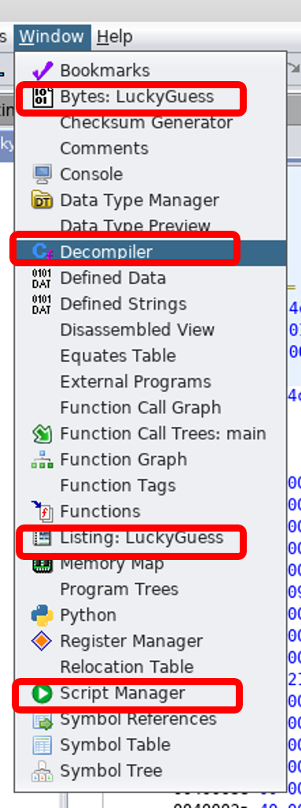
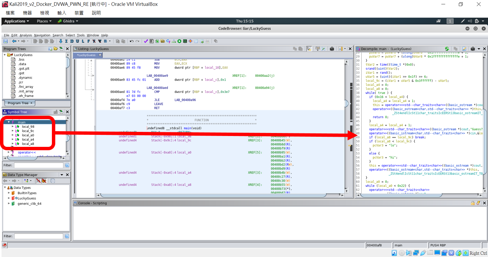

# Ghidra
- [Ghidra簡介](#Ghidra簡介)
- [安裝](#安裝)
- [Ghidra技術](#Ghidra技術)
- [示範解題](#示範解題)
- [參考書籍與推薦章節](#參考書籍與推薦章節)
- [學習資源](#學習資源)

## [Ghidra簡介](https://en.wikipedia.org/wiki/Ghidra)

- Ghidra is a software reverse engineering (SRE) suite of tools developed by NSA’s Research Directorate in support of the Cybersecurity mission.
- Ghidra is open-source.
- Ghidra framework includes a suite of full-featured, high-end software analysis tools that enable users to analyze compiled code on a variety of platforms including Windows, Mac OS, and Linux. 
- Capabilities include disassembly, assembly, decompilation, graphing, and scripting, along with hundreds of other features. 
- Ghidra supports a wide variety of process instruction sets and executable formats and can be run in both user-interactive and automated modes. 
- Users may also develop their own Ghidra plug-in components and/or scripts using the exposed API.
- In support of NSA's Cybersecurity mission, Ghidra was built to solve scaling and teaming problems on complex SRE efforts, and to provide a customizable and extensible SRE research platform. 
- NSA has applied Ghidra SRE capabilities to a variety of problems that involve analyzing malicious code and generating deep insights for NSA analysts who seek a better understanding of potential vulnerabilities in networks and systems.

## 安裝

- [Ghidra Installation Guide](https://ghidra-sre.org/InstallationGuide.html)
- [不支援32 位元 could not find decompiler executable decompile #1495](https://github.com/NationalSecurityAgency/ghidra/issues/1495)

### 撰寫 run_ghidra.sh
```
mkdir Ghidra
cd Ghidra
wget https://ghidra-sre.org/ghidra_9.0.1_PUBLIC_20190325.zip
unzip ghidra_9.0.1_PUBLIC_20190325.zip
cd ghidra_9.0.1
sudo add-apt-repository ppa:openjdk-r/ppa 
sudo apt update 
sudo apt install openjdk-11-jdk 
sudo apt install openjdk-11-jre-headless
chmod +x ghidraRun
./ghidraRun
```

### 安裝
```
bash run_ghidra.sh
要一段時間  ==>  OK
```
### 執行Running Ghidra ==>GUI Mode
```
Navigate to <GhidraInstallDir>
Run ghidraRun.bat (Windows) or ghidraRun (Linux or macOS)
```

## Ghidra技術
- 各種view 的使用: List View | Bytes view | 

  

- symbol Tree ==> 檢看 DLL 
- Version tracking ==> malware 相似度與famlily/classification
- Ghidra 設定CUSTOMIZING GHIDRA
- plugin manager
  - [Reversing Statically-Linked Binaries with Function Signatures - bin 0x2D](https://www.youtube.com/watch?v=CgGha_zLqlo)
- [JeremyBlackthorne/Ghidra-Keybindings](https://github.com/JeremyBlackthorne/Ghidra-Keybindings)
  - [Reversing: Ghidra: Import IDA-like keyboard bindings(2019)](https://www.youtube.com/watch?v=1ztztKjA50s)
- [Ghidra-Cheat-Sheet](https://hackersfun.com/wp-content/uploads/2019/03/Ghidra-Cheat-Sheet.pdf)


## 示範解題

### EasyCTF 2017_LuckyGuess解題
## 題目敘述
```
Would you like to play a guessing game?
```
## 解法

### 測試看看
```
chmod +x LuckyGuess 
ksu@Ubuntu1604-KSU:~/CTF/CTF20210818/re/reverse_CTF/LV0$ ./LuckyGuess 
Guess? 1
lo
Guess? 100
lo
Guess? 1000000
lo
Guess? 1000000000000000000
hi
```

### 先用Ghidra 分析看看
- 找main()



```
undefined8 main(void)

{
  int iVar1;
  time_t tVar2;
  char *pcVar3;
  basic_ostream *this;
  long lVar4;
  uint uVar5;
  undefined8 *puVar6;
  undefined8 *puVar7;
  byte bVar8;
  int local_a8;
  int local_a4;
  uint local_a0;
  int local_9c;
  undefined8 local_98 [18];
  
  bVar8 = 0;
  primp();
  lVar4 = 0x11;
  puVar6 = &DAT_00400d80;
  puVar7 = local_98;
  while (lVar4 != 0) {
    lVar4 = lVar4 + -1;
    *puVar7 = *puVar6;
    puVar6 = puVar6 + (ulong)bVar8 * 0x1ffffffffffffffe + 1;
    puVar7 = puVar7 + (ulong)bVar8 * 0x1ffffffffffffffe + 1;
  }
  tVar2 = time((time_t *)0x0);
  srand((uint)tVar2);
  iVar1 = rand();
  uVar5 = (uint)(iVar1 >> 0x1f) >> 6;
  
  local_9c = (iVar1 + uVar5 & 0x3ffffff) - uVar5;
  local_a4 = 0;
  local_a8 = 0;
  
  while( true ) {
    if (0x16 < local_a4) {
      local_a4 = local_a4 + 1;
      this = operator<<<std--char_traits<char>>((basic_ostream *)cout,"no dice.");
      operator<<((basic_ostream<char,std--char_traits<char>> *)this,
                 _ZSt4endlIcSt11char_traitsIcEERSt13basic_ostreamIT_T0_ES6_);
      return 0;
    }
  
    local_a4 = local_a4 + 1;
    operator<<<std--char_traits<char>>((basic_ostream *)cout,"Guess? ");
    operator>>((basic_istream<char,std--char_traits<char>> *)cin,&local_a8);
    
    if (local_a8 == local_9c) break;
    if (local_a8 < local_9c) {
      pcVar3 = "lo";
    }
    else {
      pcVar3 = "hi";
    }
    
    this = operator<<<std--char_traits<char>>((basic_ostream *)cout,pcVar3);
    operator<<((basic_ostream<char,std--char_traits<char>> *)this,
               _ZSt4endlIcSt11char_traitsIcEERSt13basic_ostreamIT_T0_ES6_);
  }
  
  local_a0 = 0;
  while (local_a0 < 0x22) {
    operator<<<std--char_traits<char>>
              ((basic_ostream *)cout,
               (byte)*(undefined4 *)(c610 + (long)(int)local_a0 * 4) ^
               (byte)*(undefined4 *)((long)local_98 + (long)(int)local_a0 * 4));
    local_a0 = local_a0 + 1;
  }
  return 1;
}
```

```
    if (local_a8 == local_9c) break;  ==>查找此處的memory位址
    if (local_a8 < local_9c) {
      pcVar3 = "lo";
    }
    else {
      pcVar3 = "hi";
    }

讓if ( local_a8 == local_9c ) break;執行成功
跳出while迴圈，進入for迴圈得到flag，

最簡單的方式就是修改jnz指令{==> 0x75}為nop指令{==> 0x90}
```

>* [NOP](https://zh.wikipedia.org/wiki/NOP)


```
gdb-peda ./LuckyGuess 
Reading symbols from ./LuckyGuess...(no debugging symbols found)...done.

gdb-peda$ disas main
Dump of assembler code for function main:
   0x0000000000400af8 <+0>:	push   rbp
   0x0000000000400af9 <+1>:	mov    rbp,rsp
   0x0000000000400afc <+4>:	sub    rsp,0xa0
   0x0000000000400b03 <+11>:	call   0x400a7e <_Z5primpv>
   0x0000000000400b08 <+16>:	lea    rdx,[rbp-0x90]
   0x0000000000400b0f <+23>:	mov    esi,0x400d80
   0x0000000000400b14 <+28>:	mov    eax,0x11
   0x0000000000400b19 <+33>:	mov    rdi,rdx
   0x0000000000400b1c <+36>:	mov    rcx,rax
   0x0000000000400b1f <+39>:	rep movs QWORD PTR es:[rdi],QWORD PTR ds:[rsi]
   0x0000000000400b22 <+42>:	mov    edi,0x0
   0x0000000000400b27 <+47>:	call   0x400930 <time@plt>
   0x0000000000400b2c <+52>:	mov    edi,eax
   0x0000000000400b2e <+54>:	call   0x4008f0 <srand@plt>
   0x0000000000400b33 <+59>:	call   0x400920 <rand@plt>
   0x0000000000400b38 <+64>:	cdq    
   0x0000000000400b39 <+65>:	shr    edx,0x6
   0x0000000000400b3c <+68>:	add    eax,edx
   0x0000000000400b3e <+70>:	and    eax,0x3ffffff
   0x0000000000400b43 <+75>:	sub    eax,edx
   0x0000000000400b45 <+77>:	mov    DWORD PTR [rbp-0x94],eax
   0x0000000000400b4b <+83>:	mov    DWORD PTR [rbp-0x9c],0x0
   0x0000000000400b55 <+93>:	mov    DWORD PTR [rbp-0xa0],0x0
   0x0000000000400b5f <+103>:	jmp    0x400c27 <main+303>
   0x0000000000400b64 <+108>:	mov    esi,0x400d60
   0x0000000000400b69 <+113>:	mov    edi,0x6021c0
   0x0000000000400b6e <+118>:	call   0x4008d0 <_ZStlsISt11char_traitsIcEERSt13basic_ostreamIcT_ES5_PKc@plt>
   0x0000000000400b73 <+123>:	lea    rax,[rbp-0xa0]
   0x0000000000400b7a <+130>:	mov    rsi,rax
   0x0000000000400b7d <+133>:	mov    edi,0x6020a0
   0x0000000000400b82 <+138>:	call   0x4008e0 <_ZNSirsERi@plt>
   0x0000000000400b87 <+143>:	mov    eax,DWORD PTR [rbp-0xa0]
   0x0000000000400b8d <+149>:	cmp    eax,DWORD PTR [rbp-0x94]
   0x0000000000400b93 <+155>:	jne    0x400bf3 <main+251>   ========>此記憶體位址 執行jne
   0x0000000000400b95 <+157>:	mov    DWORD PTR [rbp-0x98],0x0
   0x0000000000400b9f <+167>:	jmp    0x400bd9 <main+225>
   0x0000000000400ba1 <+169>:	mov    eax,DWORD PTR [rbp-0x98]
   0x0000000000400ba7 <+175>:	cdqe   
   0x0000000000400ba9 <+177>:	mov    eax,DWORD PTR [rbp+rax*4-0x90]
   0x0000000000400bb0 <+184>:	mov    edx,eax
   0x0000000000400bb2 <+186>:	mov    eax,DWORD PTR [rbp-0x98]
   0x0000000000400bb8 <+192>:	cdqe   
   0x0000000000400bba <+194>:	mov    eax,DWORD PTR [rax*4+0x602300]
   0x0000000000400bc1 <+201>:	xor    eax,edx
   0x0000000000400bc3 <+203>:	movsx  eax,al
   0x0000000000400bc6 <+206>:	mov    esi,eax
   0x0000000000400bc8 <+208>:	mov    edi,0x6021c0
   0x0000000000400bcd <+213>:	call   0x4008b0 <_ZStlsISt11char_traitsIcEERSt13basic_ostreamIcT_ES5_c@plt>
   0x0000000000400bd2 <+218>:	add    DWORD PTR [rbp-0x98],0x1
   0x0000000000400bd9 <+225>:	mov    eax,DWORD PTR [rbp-0x98]
   0x0000000000400bdf <+231>:	movsxd rdx,eax
   0x0000000000400be2 <+234>:	mov    eax,0x22
   0x0000000000400be7 <+239>:	cmp    rdx,rax
   0x0000000000400bea <+242>:	jb     0x400ba1 <main+169>
   0x0000000000400bec <+244>:	mov    eax,0x1
   0x0000000000400bf1 <+249>:	jmp    0x400c65 <main+365>
   0x0000000000400bf3 <+251>:	mov    eax,DWORD PTR [rbp-0xa0]
   0x0000000000400bf9 <+257>:	cmp    eax,DWORD PTR [rbp-0x94]
   0x0000000000400bff <+263>:	jge    0x400c08 <main+272>
   0x0000000000400c01 <+265>:	mov    eax,0x400d68
   0x0000000000400c06 <+270>:	jmp    0x400c0d <main+277>
   0x0000000000400c08 <+272>:	mov    eax,0x400d6b
   0x0000000000400c0d <+277>:	mov    rsi,rax
   0x0000000000400c10 <+280>:	mov    edi,0x6021c0
   0x0000000000400c15 <+285>:	call   0x4008d0 <_ZStlsISt11char_traitsIcEERSt13basic_ostreamIcT_ES5_PKc@plt>
   0x0000000000400c1a <+290>:	mov    esi,0x400910
   0x0000000000400c1f <+295>:	mov    rdi,rax
   0x0000000000400c22 <+298>:	call   0x400900 <_ZNSolsEPFRSoS_E@plt>
   0x0000000000400c27 <+303>:	mov    eax,DWORD PTR [rbp-0x9c]
   0x0000000000400c2d <+309>:	lea    edx,[rax+0x1]
   0x0000000000400c30 <+312>:	mov    DWORD PTR [rbp-0x9c],edx
   0x0000000000400c36 <+318>:	cmp    eax,0x16
   0x0000000000400c39 <+321>:	setle  al
   0x0000000000400c3c <+324>:	test   al,al
   0x0000000000400c3e <+326>:	jne    0x400b64 <main+108>
   0x0000000000400c44 <+332>:	mov    esi,0x400d6e
   0x0000000000400c49 <+337>:	mov    edi,0x6021c0
   0x0000000000400c4e <+342>:	call   0x4008d0 <_ZStlsISt11char_traitsIcEERSt13basic_ostreamIcT_ES5_PKc@plt>
   0x0000000000400c53 <+347>:	mov    esi,0x400910
   0x0000000000400c58 <+352>:	mov    rdi,rax
   0x0000000000400c5b <+355>:	call   0x400900 <_ZNSolsEPFRSoS_E@plt>
   0x0000000000400c60 <+360>:	mov    eax,0x0
   0x0000000000400c65 <+365>:	leave  
   0x0000000000400c66 <+366>:	ret    
End of assembler dump.

(gdb) b *0x400b93
Breakpoint 1 at 0x400b93

(gdb) r
Starting program: /home/ksu/CTF/CTF20210818/re/reverse_CTF/LV0/LuckyGuess 
Guess? 111

Breakpoint 1, 0x0000000000400b93 in main ()

(gdb) set {char}0x400b93 =0x90
(gdb) c
Continuing.
easyctf{XXXXXXXXXXXXXXX}[Inferior 1 (process 24458) exited with code 01]
```

- [InCTF Junior　blade](https://medium.com/@amustaque97/demystify-reverse-engineering-ctf-challenge-blade-40c45e7933c0)

- [easyCTF-2018-Adder](https://github.com/asinggih/easyCTF-2018-writeups/blob/master/Reverse_Engineering/Adder.md)

### binary Patch
- [Patching BInaries with Ghidra(2019)](https://www.youtube.com/watch?v=8U6JOQnOOkg)
- [YOUTUBE Patching Binaries (with vim, Binary Ninja, Ghidra and radare2)](https://www.youtube.com/watch?v=LyNyf3UM9Yc)
- [Using Radare2 to patch a binary(2019)](https://rderik.com/blog/using-radare2-to-patch-a-binary/)
- [xxd binary Patch](https://vi.stackexchange.com/questions/343/how-to-edit-binary-files-with-vim)
  - vim + xxd
  - xxd /bin/ls | vi -
  - vi:open the file ==> :%!xxd ==> make changes  ==> :%!xxd -r > new-ls (save file)

## 參考書籍與推薦章節

- [Ghidra CheatSheet](https://ghidra-sre.org/CheatSheet.html)
- [The Ghidra Book_The Definitive Guide 官方網站(含有程式碼可下載)+ 可網路購買電子書](https://ghidrabook.com/l)
  - Chapter 21: Obfuscated Code Analysis
  - Chapter 22: Patching Binaries
  - Chapter 23: Binary Differencing and Version Tracking 
- [Ghidra Software Reverse Engineering for Beginners(2021)](https://www.packtpub.com/product/ghidra-software-reverse-engineering-for-beginners/9781800207974) [[GITHUB]](https://github.com/PacktPublishing/Ghidra-Software-Reverse-Engineering-for-Beginners)
  - Chapter 5: Reversing Malware Using Ghidra
  - Chapter 6: Scripting Malware Analysis 
  - Chapter 8: Auditing Program Binaries
  - Chapter 9: Scripting Binary Audits
  - Chapter 14: Extending Ghidra for Advanced Reverse Engineering  使用miasm


## 學習資源
- [Ghidra - Journey from Classified NSA Tool to Open Source](https://www.youtube.com/watch?v=kx2xp7IQNSc&t=683s)
- [Ghidra and IDA - Solving a reverse engineering CTF crackme - AmIRootYet - Pranshu Bajpai](https://www.youtube.com/watch?v=S06pgk4DjFQ)


- [Reversing CrackMe with Ghidra (Part 1)](https://www.youtube.com/watch?v=6p5Qviusskk&t=33s)
- [Reversing CrackMe with Ghidra (Part 2)](https://www.youtube.com/watch?v=Eu9YC1Jq1Do)
- [Reversing WannaCry Part 3 - The encryption component](https://www.youtube.com/watch?v=ru5VzUigKqw)

- [N64 Decompiling with Ghidra](https://www.retroreversing.com/n64-decompiling)

## Ghidra Plugin
- [0x6d696368/ghidra_scripts](https://github.com/0x6d696368/ghidra_scripts)
- [0x6d696368/ghidra-data](https://github.com/0x6d696368/ghidra-data)
- [Using OOAnalyzer to Reverse Engineer Object Oriented Code with Ghidra](https://insights.sei.cmu.edu/blog/using-ooanalyzer-to-reverse-engineer-object-oriented-code-with-ghidra/)
