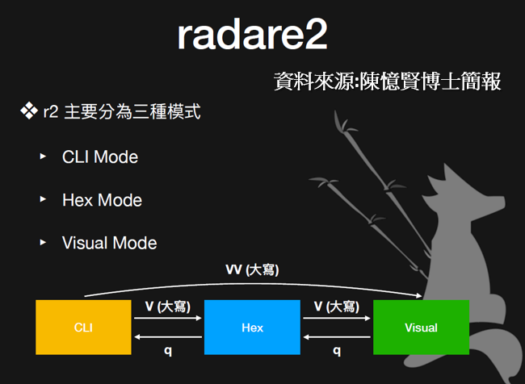

# radare2技術實戰
- [簡介](#簡介)
- [安裝](#安裝)
- [命令行使用方法](#命令行使用方法)
  - [範例練習](#範例練習)
  - [radare2/r2](#radare2r2)
- [互動式使用方法](#互動式使用方法)
  - [分析（analyze）](#分析analyze)
  - [Flags](#flags)
  - [定位（seeking）](#定位seeking)
  - [資訊（information）](#資訊information)
  - [列印（print） & 反彙編（disassembling）](#列印print--反彙編disassembling)
  - [調試（debugging）](#調試debugging)
  - [視圖模式](#視圖模式)
- [CTF解題](#CTF解題)
- [網路學習資源](#網路學習資源)

PS:忘了從哪個地方整理過來,若有同學知道來源,請告知讓我好修正

## 簡介

- Radare2擁有非常強大的功能，包括反彙編、調試、打補丁、虛擬化等等
- 可運行在幾乎所有的主流平臺上（GNU/Linux、Windows、BSD、iOS、OSX……）
- Radare2　是由一系列的元件構成的，這些元件賦予了 Radare2 強大的分析能力，可以在 Radare2 中或者單獨被使用。

### 網路資源

- [The Official Radare2 Book](https://book.rada.re/)
- [radare2 Cheatsheet](https://scoding.de/uploads/r2_cs.pdf)
- [r2con](https://rada.re/con/)
- [Radare2 Youtube 頻道](https://www.youtube.com/results?search_query=r2con)
- [Radare2 blog](https://radareorg.github.io/blog/)
- [Radare2 與其他二進位分析工具的對比](http://rada.re/r/cmp.html)

## 安裝

```bash
$ git clone https://github.com/radare/radare2.git
$ cd radare2
$ ./sys/install.sh
```

### 更新

```bash
$ ./sys/install.sh
```

### 卸載

```bash
$ make uninstall
$ make purge
```

## 命令行使用方法

radare2 有一些工具可供使用[本課程專注於radare2的技術]：
```
- radare2：十六進位編輯器和調試器的核心，通常通過它進入互動式介面。
- rabin2：從可執行二進位檔案中提取資訊。
- rasm2：彙編和反彙編。
- rahash2：基於塊的雜湊工具。
- radiff2：二進位檔案或代碼差異比對。
- rafind2：查找位元組模式。
- ragg2：r_egg 的前端，將高階語言編寫的簡單程式編譯成x86、x86-64和ARM的二進位檔案。
- rarun2：用於在不同環境中運行程式。
- rax2：資料格式轉換。
```
## 範例練習

- [範例練習:easyCTF-2018-Adder](https://github.com/asinggih/easyCTF-2018-writeups/blob/master/Reverse_Engineering/Adder.md)

- STEP 1: behavior of binary先執行看看 程式執行的行為
  - file ./adder
  - strings ./adder 
```
.....
libm.so.6
libgcc_s.so.1
libc.so.6
puts
putchar
__cxa_atexit
malloc
__libc_start_main
free
GLIBC_2.2.5
GLIBCXX_3.4
UH-x `
UH-x `
[]A\A]A^A_
Enter three numbers!
easyctf{
nope.
;*3$"
GCC: (GNU) 4.8.5 20150623 (Red Hat 4.8.5-16)
.symtab
.strtab
.....
```
- STEP 2: Reverse Engineering with Radare2 
  - r2 -h
  - r2 adder
  - [0x00400860]> aaa
    - % aa # Analyze All 
    - % aaa # 深度分析
    - % aaaa # 加入實驗功能的分析
    - [0x00400860]> a?
    - [0x00400860]> aa?

```  
Usage: a  [abdefFghoprxstc] [...]
| aa[?]              analyze all (fcns + bbs) (aa0 to avoid sub renaming)

| af[?]              analyze Functions
```

 - [0x00400860]> iI
    - i ?
    - | ie                 Entrypoint
    - | iee                Show Entry and Exit (preinit, init and fini)
    - | iE                 Exports (global symbols)
    - | iE.                Current export
    - | ih                 Headers (alias for iH)
    - | iHH                Verbose Headers in raw text
    - | ii                 Imports
    - | iI                 Binary info
 
  - [0x00400860]> afl 
    -  afl  列出所有函式 (Analyze Function List)  ==> 看看各個區段  有沒有main?

```
[0x00400860]> af?
Usage: af  
| af ([name]) ([addr])                  analyze functions (start at addr or $$)
| afr ([name]) ([addr])                 analyze functions recursively
| af+ addr name [type] [diff]           hand craft a function (requires afb+)
| afi [addr|fcn.name]                   show function(s) information (verbose afl)
| afl[?] [ls*] [fcn name]               list functions (addr, size, bbs, name) (see afll)
......
```
  - [0x00400860]> p?
    - [0x00400860]> pd?
    - [0x00400860]> pd $n_line  ==>印出當前位置開始 n ⾏的組合語⾔ (Print Disassemble)
  - [0x00400860]> pdf ==> 反組譯
  - [0x00400860]> pdf @ main ==> 反組譯 main()函數 ==> 開始分析程式邏輯 ==> 找出關鍵程式段落
```
|           0x00400b8d      488945f8       mov qword [ptr], rax
|           0x00400b91      8b55f4         mov edx, dword [local_ch]
|           0x00400b94      8b45f0         mov eax, dword [local_10h]
|           0x00400b97      01c2           add edx, eax
|           0x00400b99      8b45ec         mov eax, dword [local_14h]
|           0x00400b9c      01d0           add eax, edx
|           0x00400b9e      3d39050000     cmp eax, 0x539              ; 1337
|       ,=< 0x00400ba3      7527           jne 0x400bcc
```
  - 用Visual Mode來看更清楚
    - [0x00400b1e]> s main　==> 先找(seek) main()函數 
      - seek command ==> change our position/point of view in the binary
      - % s $function_name # Ex. s main
      - % s $address # Ex. s 0x0000610
      - [Seeking](https://book.rada.re/basic_commands/seeking.html)
    - [0x00400b1e]> V  按enter 　==> 進入 hex mode 
    - 在 hex mode 輸入 V  按enter ==> 進入 Visual Mode
    - 在 Visual Mode 使用上下鍵移動  ==> 找關鍵程式
      - [Navigation: Navigation can be done using HJKL or arrow keys and PgUp/PgDown keys.](https://book.rada.re/visual_mode/intro.html)
      - 查看指令 ==> 按 ? ==>To see help on all key bindings defined for visual mode, press ?:
    - [Modes of Operation三種運作模式](https://monosource.gitbooks.io/radare2-explorations/content/intro/modes.html) [資料來源: Radare2 Explorations](https://monosource.gitbooks.io/radare2-explorations/content/)
      - CLI (Command Line Interface)
      - Hex Mode
      - Visual Mode
    - 資料來源:陳憶賢博士簡報
    
 

 - 退出到上⼀層 / 退出 r2 (Quit)  ==> % q

- [0x00400860]> !python3
  - 可以在radare2 session執行外部指令 

### radare2/r2
```text
$ r2 -h
Usage: r2 [-ACdfLMnNqStuvwzX] [-P patch] [-p prj] [-a arch] [-b bits] [-i file]
          [-s addr] [-B baddr] [-M maddr] [-c cmd] [-e k=v] file|pid|-|--|=
 --           run radare2 without opening any file
 -            same as 'r2 malloc://512'
 =            read file from stdin (use -i and -c to run cmds)
 -=           perform !=! command to run all commands remotely
 -0           print \x00 after init and every command
 -a [arch]    set asm.arch
 -A           run 'aaa' command to analyze all referenced code
 -b [bits]    set asm.bits
 -B [baddr]   set base address for PIE binaries
 -c 'cmd..'   execute radare command
 -C           file is host:port (alias for -c+=http://%s/cmd/)
 -d           debug the executable 'file' or running process 'pid'
 -D [backend] enable debug mode (e cfg.debug=true)
 -e k=v       evaluate config var
 -f           block size = file size
 -F [binplug] force to use that rbin plugin
 -h, -hh      show help message, -hh for long
 -H ([var])   display variable
 -i [file]    run script file
 -I [file]    run script file before the file is opened
 -k [k=v]     perform sdb query into core->sdb
 -l [lib]     load plugin file
 -L           list supported IO plugins
 -m [addr]    map file at given address (loadaddr)
 -M           do not demangle symbol names
 -n, -nn      do not load RBin info (-nn only load bin structures)
 -N           do not load user settings and scripts
 -o [OS/kern] set asm.os (linux, macos, w32, netbsd, ...)
 -q           quiet mode (no prompt) and quit after -i
 -p [prj]     use project, list if no arg, load if no file
 -P [file]    apply rapatch file and quit
 -R [rarun2]  specify rarun2 profile to load (same as -e dbg.profile=X)
 -s [addr]    initial seek
 -S           start r2 in sandbox mode
 -t           load rabin2 info in thread
 -u           set bin.filter=false to get raw sym/sec/cls names
 -v, -V       show radare2 version (-V show lib versions)
 -w           open file in write mode
 -X [rr2rule] specify custom rarun2 directive
 -z, -zz      do not load strings or load them even in raw
```
- 開始逆向 ==> r2 $binary
- 如果想 attach 到一個進程上，則使用 `pid`。

- 常用參數如下：
- `-A`：相當於在交互介面輸入了 `aaa`。
- `-c`：運行 radare 命令。（`r2 -A -q -c 'iI~pic' file`）
- `-d`：調試二進位檔案或進程。
- `-a`,`-b`,`-o`：分別指定體系結構、位元數和作業系統，通常是自動的，但也可以手動指定。
- `-w`：使用可寫模式打開。

## 互動式使用方法

- 當進入到 Radare2 的互動式介面後，就可使用互動式命令進行操作。

### 查詢指令的用法

- % ? # 查詢所有指令
- % p? # 查詢 p 相關指令
- % pd? # 查詢 pd 相關指令

```text
[0x00000000]> ?
Usage: [.][times][cmd][~grep][@[@iter]addr!size][|>pipe] ; ...
Append '?' to any char command to get detailed help
Prefix with number to repeat command N times (f.ex: 3x)
|%var =valueAlias for 'env' command
| *[?] off[=[0x]value]    Pointer read/write data/values (see ?v, wx, wv)
| (macro arg0 arg1)       Manage scripting macros
| .[?] [-|(m)|f|!sh|cmd]  Define macro or load r2, cparse or rlang file
| =[?] [cmd]              Send/Listen for Remote Commands (rap://, http://, <fd>)
| /[?]                    Search for bytes, regexps, patterns, ..
| ![?] [cmd]              Run given command as in system(3)
| #[?] !lang [..]         Hashbang to run an rlang script
| a[?]                    Analysis commands
| b[?]                    Display or change the block size
| c[?] [arg]              Compare block with given data
| C[?]                    Code metadata (comments, format, hints, ..)
| d[?]                    Debugger commands
| e[?] [a[=b]]            List/get/set config evaluable vars
| f[?] [name][sz][at]     Add flag at current address
| g[?] [arg]              Generate shellcodes with r_egg
| i[?] [file]             Get info about opened file from r_bin
| k[?] [sdb-query]        Run sdb-query. see k? for help, 'k *', 'k **' ...
| L[?] [-] [plugin]       list, unload load r2 plugins
| m[?]                    Mountpoints commands
| o[?] [file] ([offset])  Open file at optional address
| p[?] [len]              Print current block with format and length
| P[?]                    Project management utilities
| q[?] [ret]              Quit program with a return value
| r[?] [len]              Resize file
| s[?] [addr]             Seek to address (also for '0x', '0x1' == 's 0x1')
| S[?]                    Io section manipulation information
| t[?]                    Types, noreturn, signatures, C parser and more
| T[?] [-] [num|msg]      Text log utility
| u[?]                    uname/undo seek/write
| V                       Enter visual mode (V! = panels, VV = fcngraph, VVV = callgraph)
| w[?] [str]              Multiple write operations
| x[?] [len]              Alias for 'px' (print hexadecimal)
| y[?] [len] [[[@]addr    Yank/paste bytes from/to memory
| z[?]                    Zignatures management
| ?[??][expr]             Help or evaluate math expression
| ?$?                     Show available '$' variables and aliases
| ?@?                     Misc help for '@' (seek), '~' (grep) (see ~??)
| ?:?                     List and manage core plugins
```

- Radare2 交互命令的一般格式(如下所示)：

```text
[.][times][cmd][~grep][@[@iter]addr!size][|>pipe] ; ...
```

如果你對 *nix shell, sed, awk 等比較熟悉的話，也可以幫助你很快掌握 radare2 命令。

- 在任意字元命令後面加上 `?`　可以獲得關於該命令更多的細節。如 `a?`、`p?`、`!?`、`@?`。
- 當命令以數字開頭時表示重複運行的次數。如 `3x`。
- `!` 單獨使用可以顯示命令使用歷史記錄。
- `;` 是命令分隔符號，可以在一行上運行多個命令。如 `px 10; pd 20`。
- `..` 重複運行上一條命令，使用回車鍵也一樣。
- `/` 用於在檔中進行搜索操作。
- 以 `!` 開頭可以運行 shell 命令。用法：`!<cmd>`。
  - `!ls`
- `|` 是管道符。用法：`<r2command> | <program|H|>`。
  - `pd | less`
- `~` 用於文本比配（grep）
  - 用法：`[command]~[modifier][word,word][endmodifier][[column]][:line]`。
  - `i~:0` 顯示 `i` 輸出的第一行
  - `pd~mov,eax` 反彙編並匹配 mov 或 eax 所在行
  - `pi~mov&eax` 匹配 mov 和 eax 都有的行
  - `i~0x400$` 匹配以 0x400 結尾的行
- `???` 可以獲得以 `?` 開頭的命令的細節
  - `?` 可以做各種進制和格式的快速轉換。如 `? 1234`
  - `?p vaddr` 獲得虛擬位址 vaddr 的實體位址(physical address)
  - `?P paddr` 獲得實體位址 paddr 的虛擬位址
  - `?v` 以十六進位的形式顯示某數學運算式的結果。如 `?v eip-0x804800`。
  - `?l str` 獲得 str 的長度，結果被臨時保存，使用 `?v` 可輸出結果。
- `@@` foreach 反覆運算器，在列出的偏移處重複執行命令。
  - `wx ff @@ 10 20 30` 在偏移 10、20、30 處寫入 ff
  - `p8 4 @@ fcn.*` 列印處每個函數的頭 4 個位元組
- `?$?` 可以顯示運算式所使用變數的説明資訊。用法：`?v [$.]`。
  - `$$` 是當前所處的虛擬位址
  - `$?` 是最後一個運算的值
  - `$s` 文件大小
  - `$b` 塊大小
  - `$l` 操作碼長度
  - `$j` 跳轉地址。當 `$$` 處是一個類似 `jmp` 的指令時，`$j` 中保存著將要跳轉到的位址
  - `$f` 跳轉失敗地址。即當前跳轉沒有生效，`$f` 中保存下一條指令的位址
  - `$m` 操作碼記憶體引用。如：`mov eax,[0x10] => 0x10`
- `e` 用於進行配置資訊的修改
  - `e asm.bytes=false` 關閉指令 raw bytes 的顯示

預設情況下，執行的每條命令都有一個參考點，通常是記憶體中的當前位置，由命令前的十六進位數字指示。任何的列印、寫入或分析命令都在當前位置執行。例如反彙編當前位置的一條指令：

```text
[0x00005060]> pd 1
            ;-- entry0:
            ;-- rip:
            0x00005060      31ed           xor ebp, ebp
```

block size 是在我們沒有指定行數的時候使用的預設值，輸入 `b` 即可看到，使用 `b [num]` 修改位元組數，這時使用列印命令如 `pd` 時，將反彙編相應位元組的指令。

```text
[0x00005060]> b
0x100
[0x00005060]> b 10
[0x00005060]> b
0xa
[0x00005060]> pd
            ;-- entry0:
            ;-- rip:
            0x00005060      31ed           xor ebp, ebp
            0x00005062      4989d1         mov r9, rdx
```

### 分析（analyze）

所有與分析有關的命令都以 `a` 開頭：

```text
[0x00000000]> a?
|Usage: a[abdefFghoprxstc] [...]
| ab [hexpairs]    analyze bytes
| abb [len]        analyze N basic blocks in [len] (section.size by default)
| aa[?]            analyze all (fcns + bbs) (aa0 to avoid sub renaming)
| ac [cycles]      analyze which op could be executed in [cycles]
| ad[?]            analyze data trampoline (wip)
| ad [from] [to]   analyze data pointers to (from-to)
| ae[?] [expr]     analyze opcode eval expression (see ao)
| af[?]            analyze Functions
| aF               same as above, but using anal.depth=1
| ag[?] [options]  output Graphviz code
| ah[?]            analysis hints (force opcode size, ...)
| ai [addr]        address information (show perms, stack, heap, ...)
| ao[?] [len]      analyze Opcodes (or emulate it)
| aO               Analyze N instructions in M bytes
| ar[?]            like 'dr' but for the esil vm. (registers)
| ap               find prelude for current offset
| ax[?]            manage refs/xrefs (see also afx?)
| as[?] [num]      analyze syscall using dbg.reg
| at[?] [.]        analyze execution traces
| av[?] [.]        show vtables
```

```text
[0x00000000]> aa?
|Usage: aa[0*?] # see also 'af' and 'afna'
| aa                  alias for 'af@@ sym.*;af@entry0;afva'
| aa*                 analyze all flags starting with sym. (af @@ sym.*)
| aaa[?]              autoname functions after aa (see afna)
| aab                 aab across io.sections.text
| aac [len]           analyze function calls (af @@ `pi len~call[1]`)
| aad [len]           analyze data references to code
| aae [len] ([addr])  analyze references with ESIL (optionally to address)
| aai[j]              show info of all analysis parameters
| aar[?] [len]        analyze len bytes of instructions for references
| aan                 autoname functions that either start with fcn.* or sym.func.*
| aas [len]           analyze symbols (af @@= `isq~[0]`)
| aat [len]           analyze all consecutive functions in section
| aaT [len]           analyze code after trap-sleds
| aap                 find and analyze function preludes
| aav [sat]           find values referencing a specific section or map
| aau [len]           list mem areas (larger than len bytes) not covered by functions
```

- `afl`：列出所有函數。
- `axt [addr]`：找到對給定地址的交叉引用。
- `af [addr]`：當你發現某個位址處有一個函數，但是沒有被分析出來的時候，可以使用該命令重新分析。

### Flags

flag 用於將給定的偏移與名稱相關聯，flag 被分為幾個 flag spaces，用於存放不同的 flag。

```text
[0x00000000]> f?
|Usage: f [?] [flagname] # Manage offset-name flags
| f                        list flags (will only list flags from selected flagspaces)
| f?flagname               check if flag exists or not, See ?? and ?!
| f. [*[*]]                list local per-function flags (*) as r2 commands
| f.blah=$$+12             set local function label named 'blah'
| f*                       list flags in r commands
| f name 12 @ 33           set flag 'name' with length 12 at offset 33
| f name = 33              alias for 'f name @ 33' or 'f name 1 33'
| f name 12 33 [cmt]       same as above + optional comment
| f-.blah@fcn.foo          delete local label from function at current seek (also f.-)
| f--                      delete all flags and flagspaces (deinit)
| f+name 12 @ 33           like above but creates new one if doesnt exist
| f-name                   remove flag 'name'
| f-@addr                  remove flag at address expression
| f. fname                 list all local labels for the given function
| f= [glob]                list range bars graphics with flag offsets and sizes
| fa [name] [alias]        alias a flag to evaluate an expression
| fb [addr]                set base address for new flags
| fb [addr] [flag*]        move flags matching 'flag' to relative addr
| fc[?][name] [color]      set color for given flag
| fC [name] [cmt]          set comment for given flag
| fd addr                  return flag+delta
| fe-                      resets the enumerator counter
| fe [name]                create flag name.#num# enumerated flag. See fe?
| fi [size] | [from] [to]  show flags in current block or range
| fg                       bring visual mode to foreground
| fj                       list flags in JSON format
| fl (@[flag]) [size]      show or set flag length (size)
| fla [glob]               automatically compute the size of all flags matching glob
| fm addr                  move flag at current offset to new address
| fn                       list flags displaying the real name (demangled)
| fo                       show fortunes
| fr [old] [[new]]         rename flag (if no new flag current seek one is used)
| fR[?] [f] [t] [m]        relocate all flags matching f&~m 'f'rom, 't'o, 'm'ask
| fs[?]+-*                 manage flagspaces
| fS[on]                   sort flags by offset or name
| fV[*-] [nkey] [offset]   dump/restore visual marks (mK/'K)
| fx[d]                    show hexdump (or disasm) of flag:flagsize
| fz[?][name]              add named flag zone -name to delete. see fz?[name]
```

常見用法：

- `f flag_name @ addr`：給位址 addr 創建一個 flag，當不指定位址時則默認指定當前地址。
- `f-flag_name`：刪除flag。
- `fs`：管理命名空間。

  ```text
  [0x00005060]> fs?
  |Usage: fs [*] [+-][flagspace|addr] # Manage flagspaces
  | fs            display flagspaces
  | fs*           display flagspaces as r2 commands
  | fsj           display flagspaces in JSON
  | fs *          select all flagspaces
  | fs flagspace  select flagspace or create if it doesn't exist
  | fs-flagspace  remove flagspace
  | fs-*          remove all flagspaces
  | fs+foo        push previous flagspace and set
  | fs-           pop to the previous flagspace
  | fs-.          remove the current flagspace
  | fsm [addr]    move flags at given address to the current flagspace
  | fss           display flagspaces stack
  | fss*          display flagspaces stack in r2 commands
  | fssj          display flagspaces stack in JSON
  | fsr newname   rename selected flagspace
  ```

### 定位（seeking）

使用 `s` 命令可以改變當前位置：

```text
[0x00000000]> s?
|Usage: s  # Seek commands
| s                 Print current address
| s:pad             Print current address with N padded zeros (defaults to 8)
| s addr            Seek to address
| s-                Undo seek
| s- n              Seek n bytes backward
| s--               Seek blocksize bytes backward
| s+                Redo seek
| s+ n              Seek n bytes forward
| s++               Seek blocksize bytes forward
| s[j*=!]           List undo seek history (JSON, =list, *r2, !=names, s==)
| s/ DATA           Search for next occurrence of 'DATA'
| s/x 9091          Search for next occurrence of \x90\x91
| s.hexoff          Seek honoring a base from core->offset
| sa [[+-]a] [asz]  Seek asz (or bsize) aligned to addr
| sb                Seek aligned to bb start
| sC[?] string      Seek to comment matching given string
| sf                Seek to next function (f->addr+f->size)
| sf function       Seek to address of specified function
| sg/sG             Seek begin (sg) or end (sG) of section or file
| sl[?] [+-]line    Seek to line
| sn/sp             Seek to next/prev location, as specified by scr.nkey
| so [N]            Seek to N next opcode(s)
| sr pc             Seek to register
| ss                Seek silently (without adding an entry to the seek history)
```

- `s+`,`s-`：重複或撤銷。
- `s+ n`,`s- n`：定位到當前位置向前或向後 n 位元組的位置。
- `s/ DATA`：定位到下一個出現 DATA 的位置。

### 信息（information）

```text
[0x00000000]> i?
|Usage: i Get info from opened file (see rabin2's manpage)
| Output mode:
| '*'                Output in radare commands
| 'j'                Output in json
| 'q'                Simple quiet output
| Actions:
| i|ij               Show info of current file (in JSON)
| iA                 List archs
| ia                 Show all info (imports, exports, sections..)
| ib                 Reload the current buffer for setting of the bin (use once only)
| ic                 List classes, methods and fields
| iC                 Show signature info (entitlements, ...)
| id[?]              Debug information (source lines)
| iD lang sym        demangle symbolname for given language
| ie                 Entrypoint
| iE                 Exports (global symbols)
| ih                 Headers (alias for iH)
| iHH                Verbose Headers in raw text
| ii                 Imports
| iI                 Binary info
| ik [query]         Key-value database from RBinObject
| il                 Libraries
| iL [plugin]        List all RBin plugins loaded or plugin details
| im                 Show info about predefined memory allocation
| iM                 Show main address
| io [file]          Load info from file (or last opened) use bin.baddr
| ir                 Relocs
| iR                 Resources
| is                 Symbols
| iS [entropy,sha1]  Sections (choose which hash algorithm to use)
| iV                 Display file version info
| iz|izj             Strings in data sections (in JSON/Base64)
| izz                Search for Strings in the whole binary
| iZ                 Guess size of binary program
```

`i` 系列命令用於獲取檔的各種資訊，這時配合上 `~` 命令來獲得精確的輸出，下面是一個類似 checksec 的輸出：

```text
[0x00005060]> iI ~relro,canary,nx,pic,rpath
canary   true
nx       true
pic      true
relro    full
rpath    NONE
```

`~` 命令還有一些其他的用法，如獲取某一行某一列等，另外使用 `~{}` 可以使 json 的輸出更好看：

```text
[0x00005060]> ~?
|Usage: [command]~[modifier][word,word][endmodifier][[column]][:line]
modifier:
|  &            all words must match to grep the line
|  $[n]         sort numerically / alphabetically the Nth column
|  +            case insensitive grep (grep -i)
|  ^            words must be placed at the beginning of line
|  !            negate grep
|  ?            count number of matching lines
|  ?.           count number chars
|  ??           show this help message
|  :[s]-[e]     show lines s-e
|  ..           internal 'less'
|  ...          internal 'hud' (like V_)
|  {}           json indentation
|  {path}       json grep
|  {}..         less json indentation
| endmodifier:  
|  $            words must be placed at the end of line
| column:
|  [n]          show only column n
|  [n-m]        show column n to m
|  [n-]         show all columns starting from column n
|  [i,j,k]      show the columns i, j and k
| Examples:
|  i~:0         show first line of 'i' output
|  i~:-2        show first three lines of 'i' output
|  pd~mov       disasm and grep for mov
|  pi~[0]       show only opcode
|  i~0x400$     show lines ending with 0x400
```

### 列印（print） & 反彙編（disassembling）

```text
[0x00000000]> p?
|Usage: p[=68abcdDfiImrstuxz] [arg|len] [@addr]
| p=[?][bep] [blks] [len] [blk]  show entropy/printable chars/chars bars
| p2 [len]                       8x8 2bpp-tiles
| p3 [file]                      print stereogram (3D)
| p6[de] [len]                   base64 decode/encode
| p8[?][j] [len]                 8bit hexpair list of bytes
| pa[edD] [arg]                  pa:assemble  pa[dD]:disasm or pae: esil from hexpairs
| pA[n_ops]                      show n_ops address and type
| p[b|B|xb] [len] ([skip])       bindump N bits skipping M
| pb[?] [n]                      bitstream of N bits
| pB[?] [n]                      bitstream of N bytes
| pc[?][p] [len]                 output C (or python) format
| pC[d] [rows]                   print disassembly in columns (see hex.cols and pdi)
| pd[?] [sz] [a] [b]             disassemble N opcodes (pd) or N bytes (pD)
| pf[?][.nam] [fmt]              print formatted data (pf.name, pf.name $<expr>)
| ph[?][=|hash] ([len])          calculate hash for a block
| p[iI][df] [len]                print N ops/bytes (f=func) (see pi? and pdi)
| pm[?] [magic]                  print libmagic data (see pm? and /m?)
| pr[?][glx] [len]               print N raw bytes (in lines or hexblocks, 'g'unzip)
| p[kK] [len]                    print key in randomart (K is for mosaic)
| ps[?][pwz] [len]               print pascal/wide/zero-terminated strings
| pt[?][dn] [len]                print different timestamps
| pu[?][w] [len]                 print N url encoded bytes (w=wide)
| pv[?][jh] [mode]               show variable/pointer/value in memory
| p-[?][jh] [mode]               bar|json|histogram blocks (mode: e?search.in)
| px[?][owq] [len]               hexdump of N bytes (o=octal, w=32bit, q=64bit)
| pz[?] [len]                    print zoom view (see pz? for help)
| pwd                            display current working directory
```

常用參數如下：

- `px`：輸出十六進位數、偏移和原始資料。後跟 `o`,`w`,`q` 時分別表示8位、32位和64位。
- `p8`：輸出8位元的位元組流。
- `ps`：輸出字串。

- radare2 中反彙編操作是隱藏在列印操作中的，即使用 `pd`：

```text
[0x00000000]> pd?
|Usage: p[dD][ajbrfils] [sz] [arch] [bits] # Print Disassembly
| NOTE: len  parameter can be negative
| NOTE:      Pressing ENTER on empty command will repeat last pd command and also seek to end of disassembled range.
| pd N       disassemble N instructions
| pd -N      disassemble N instructions backward
| pD N       disassemble N bytes
| pda        disassemble all possible opcodes (byte per byte)
| pdb        disassemble basic block
| pdc        pseudo disassembler output in C-like syntax
| pdC        show comments found in N instructions
| pdk        disassemble all methods of a class
| pdj        disassemble to json
| pdr        recursive disassemble across the function graph
| pdf        disassemble function
| pdi        like 'pi', with offset and bytes
| pdl        show instruction sizes
| pds[?]     disassemble summary (strings, calls, jumps, refs) (see pdsf and pdfs)
| pdt        disassemble the debugger traces (see atd)
```

`@addr` 表示一個相對定址，這裡的 addr 可以是位址、符號名等，這個操作和 `s` 命令不同，它不會改變當前位置，當然即使使用類似 `s @addr` 的命令也不會改變當前位置。

```text
[0x00005060]> pd 5 @ main
            ;-- main:
            ;-- section..text:
            0x00003620      4157           push r15                    ; section 13 va=0x00003620 pa=0x00003620 sz=75529 vsz=75529 rwx=--r-x .text
            0x00003622      4156           push r14
            0x00003624      4155           push r13
            0x00003626      4154           push r12
            0x00003628      55             push rbp
[0x00005060]> s @ main
0x3620
[0x00005060]> s 0x3620
[0x00003620]>
```
### 調試（debugging）

在開啟 r2 時使用參數 `-d` 即可開啟調試模式，當然如果你已經載入了程式，可以使用命令 `ood` 重新開啟調試。

```text
[0x7f8363c75f30]> d?
|Usage: d # Debug commands
| db[?]                   Breakpoints commands
| dbt[?]                  Display backtrace based on dbg.btdepth and dbg.btalgo
| dc[?]                   Continue execution
| dd[?]                   File descriptors (!fd in r1)
| de[-sc] [rwx] [rm] [e]  Debug with ESIL (see de?)
| dg <file>               Generate a core-file (WIP)
| dH [handler]            Transplant process to a new handler
| di[?]                   Show debugger backend information (See dh)
| dk[?]                   List, send, get, set, signal handlers of child
| dL [handler]            List or set debugger handler
| dm[?]                   Show memory maps
| do[?]                   Open process (reload, alias for 'oo')
| doo[args]               Reopen in debugger mode with args (alias for 'ood')
| dp[?]                   List, attach to process or thread id
| dr[?]                   Cpu registers
| ds[?]                   Step, over, source line
| dt[?]                   Display instruction traces (dtr=reset)
| dw <pid>                Block prompt until pid dies
| dx[?]                   Inject and run code on target process (See gs)
```

### 視圖模式

- 在調試時使用視圖模式是十分有用的，因為你既可以查看程式當前的位置，也可以查看任何你想看的位置。
- 輸入 `V` 即可進入視圖模式，按下 `p/P` 可在不同模式之間進行切換，按下 `?` 即可查看幫助，想退出時按下 `q`。

```text
Visual mode help:
?        show this help
 ??       show the user-friendly hud
 $        toggle asm.pseudo
 %        in cursor mode finds matching pair, otherwise toggle autoblocksz
 @        redraw screen every 1s (multi-user view), in cursor set position
 !        enter into the visual panels mode
 _        enter the flag/comment/functions/.. hud (same as VF_)
 =        set cmd.vprompt (top row)
 |        set cmd.cprompt (right column)
 .        seek to program counter
 "        toggle the column mode (uses pC..)
 /        in cursor mode search in current block
 :cmd     run radare command
 ;[-]cmt  add/remove comment
 0        seek to beginning of current function
 [1-9]    follow jmp/call identified by shortcut (like ;[1])
 ,file    add a link to the text file
 /*+-[]   change block size, [] = resize hex.cols
 </>      seek aligned to block size (seek cursor in cursor mode)
 a/A      (a)ssemble code, visual (A)ssembler
 b        toggle breakpoint
 B        enumerate and inspect classes
 c/C      toggle (c)ursor and (C)olors
 d[f?]    define function, data, code, ..
 D        enter visual diff mode (set diff.from/to)
 e        edit eval configuration variables
 f/F      set/unset or browse flags. f- to unset, F to browse, ..
 gG       go seek to begin and end of file (0-$s)
 hjkl     move around (or HJKL) (left-down-up-right)
 i        insert hex or string (in hexdump) use tab to toggle
 mK/'K    mark/go to Key (any key)
 M        walk the mounted filesystems
 n/N      seek next/prev function/flag/hit (scr.nkey)
 o        go/seek to given offset
 O        toggle asm.esil
 p/P      rotate print modes (hex, disasm, debug, words, buf)
 q        back to radare shell
 r        refresh screen / in cursor mode browse comments
 R        randomize color palette (ecr)
 sS       step / step over
 t        browse types
 T        enter textlog chat console (TT)
 uU       undo/redo seek
 v        visual function/vars code analysis menu
 V        (V)iew graph using cmd.graph (agv?)
 wW       seek cursor to next/prev word
 xX       show xrefs/refs of current function from/to data/code
 yY       copy and paste selection
 z        fold/unfold comments in disassembly
 Z        toggle zoom mode
 Enter    follow address of jump/call
Function Keys: (See 'e key.'), defaults to:
  F2      toggle breakpoint
  F4      run to cursor
  F7      single step
  F8      step over
  F9      continue
```

視圖模式下的命令和命令列模式下的命令有很大不同，下面列出幾個，更多的命令請查看幫助：

- `o`：定位到給定的偏移。
- `;`：添加注釋。
- `V`：查看圖形。
- `:`：運行 radare2 命令

## CTF解題
- [InCTF Junior　blade](https://medium.com/@amustaque97/demystify-reverse-engineering-ctf-challenge-blade-40c45e7933c0)
- [easyCTF-2018-Adder](https://github.com/asinggih/easyCTF-2018-writeups/blob/master/Reverse_Engineering/Adder.md)

## 網路學習資源
- [Using Radare2 to patch a binary(2019)](https://rderik.com/blog/using-radare2-to-patch-a-binary/)
